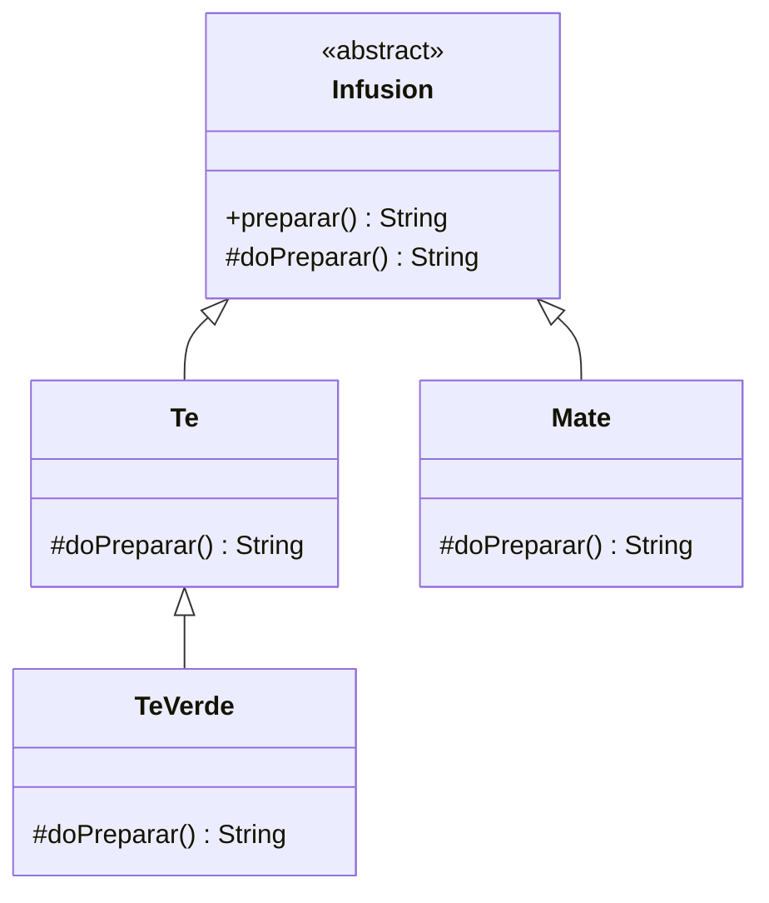

# Patrón Template Method — Infusiones

Esta rama, `agregarPlantilla`, extiende el ejercicio disponible en `main` agregando una nueva especialización de té para profundizar la reutilización del comportamiento ya definido.

## Objetivo

Definir una secuencia general para preparar una infusión y permitir que cada tipo concreto personalice únicamente los pasos necesarios.

La clase abstracta `Infusion` concentra el algoritmo general: primero se calienta el agua y luego se delega la preparación específica mediante `doPreparar()`.

## Diferencias respecto de `main`

La rama `main` contiene:

- `Infusion` como clase abstracta.
- `Te` y `Mate` como implementaciones concretas.

En esta rama se agrega:

- `TeVerde`, que hereda de `Te`.
- `TeVerde` redefine `doPreparar()` para agregar el paso **“Elegir el saquito de té verde”**.
- Luego reutiliza el comportamiento de `Te` mediante `super.doPreparar()` en lugar de duplicarlo.
- Se incorpora un test específico para verificar la preparación completa del té verde.

La diferencia permite observar que una especialización puede extender un paso del algoritmo y reutilizar el comportamiento de su clase padre.

## Patrón aplicado: Template Method

**Template Method** define el esqueleto de un algoritmo en una clase base y permite que las subclases redefinan algunos pasos sin alterar la estructura general del proceso.

### Participantes

- `Infusion`: clase abstracta que define el método plantilla `preparar()`.
- `doPreparar()`: paso variable que las subclases especializan.
- `Te`: preparación concreta de té.
- `Mate`: preparación concreta de mate.
- `TeVerde`: especialización de `Te` añadida en esta rama.

## Diagrama UML del dominio



## Funcionamiento

1. `Infusion.preparar()` establece el flujo común y comienza calentando agua.
2. Luego se ejecuta `doPreparar()`.
3. `Te` y `Mate` implementan ese paso de forma diferente.
4. `TeVerde` especializa la preparación de `Te`: agrega un paso propio y luego reutiliza `Te.doPreparar()`.

## Estructura principal

```text
src/
├── main/java/ar/edu/unahur/obj2/infusiones/
│   ├── Infusion.java
│   ├── Te.java
│   ├── Mate.java
│   └── TeVerde.java
└── test/java/ar/edu/unahur/obj2/infusiones/
    └── InfusionTest.java
```

## Ejecutar las pruebas

Desde la raíz del proyecto:

```bash
mvn test
```

## Conceptos practicados

- Patrón Template Method.
- Herencia y clases abstractas.
- Reutilización de comportamiento común.
- Especialización de pasos de un algoritmo.
- Uso de `super` para extender comportamiento existente.
- Pruebas unitarias con JUnit.
