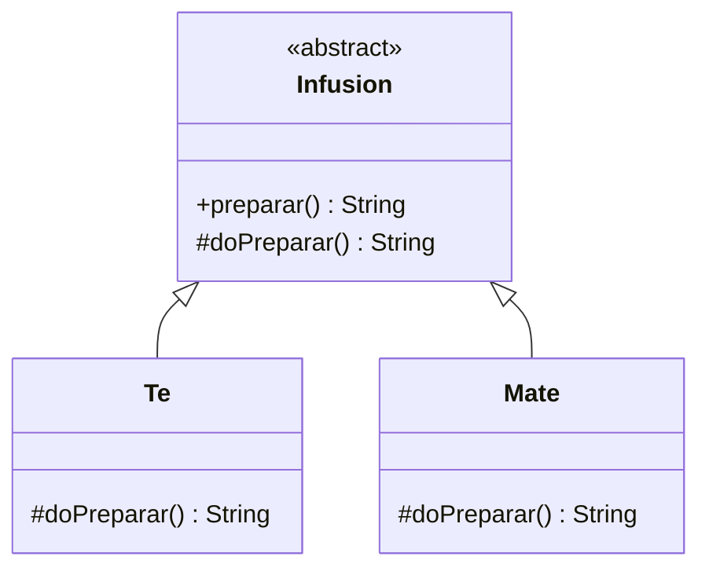

# Patrón Template Method — Infusiones

Ejercicio de **Patrones de Diseño** que implementa el patrón de comportamiento **Template Method** mediante la preparación de distintas infusiones.

## Objetivo

Definir una secuencia general para preparar una infusión y permitir que cada tipo concreto personalice únicamente el paso que cambia.

La clase abstracta `Infusion` concentra el algoritmo general: primero se calienta el agua y luego se delega en cada subclase la preparación específica.

## Patrón aplicado: Template Method

**Template Method** define el esqueleto de un algoritmo en una clase base y permite que las subclases redefinan algunos pasos sin alterar la estructura general del proceso.

### Participantes

- `Infusion`: clase abstracta que define el método plantilla `preparar()`.
- `doPreparar()`: paso variable que cada subclase debe implementar.
- `Te`: preparación concreta de té.
- `Mate`: preparación concreta de mate.

## Diagrama UML del dominio



## Funcionamiento

1. `Infusion.preparar()` establece el flujo común.
2. El proceso siempre comienza calentando agua.
3. Luego se ejecuta `doPreparar()`.
4. Cada subclase implementa ese paso según el tipo de infusión.

De esta manera, el algoritmo general permanece centralizado y se evita duplicar los pasos comunes.

## Estructura principal

```text
src/
├── main/java/ar/edu/unahur/obj2/infusiones/
│   ├── Infusion.java
│   ├── Te.java
│   └── Mate.java
└── test/java/ar/edu/unahur/obj2/infusiones/
    └── InfusionTest.java
```

## Ejecutar las pruebas

Desde la raíz del proyecto:

```bash
mvn test
```

## Conceptos practicados

- Patrón Template Method.
- Herencia y clases abstractas.
- Reutilización de comportamiento común.
- Especialización de pasos de un algoritmo.
- Pruebas unitarias con JUnit.
